# MDBench
<div align="center">

[](https://www.python.org/)
[](LICENSE)
[](https://arxiv.org/abs/2509.20529)
[](https://doi.org/10.5281/zenodo.17611099)

**Official implementation of paper [MDBench: Benchmarking Data-Driven Methods for Model Discovery](https://arxiv.org/abs/2509.20529) (AAAI 2026 Oral)**

[🧭 Overview](#overview) • [🛠️ 🚀 Usage](#usage) • [🔬 Datasets](#datasets) • [📊 Methods](#methods) • [📚 Citation](#citation)

</div>

## Overview

MDBench is an open-source benchmarking framework for evaluating model discovery methods on dynamical systems. MDBench assesses 12 algorithms on 14 partial differential equations (PDEs) and 63 ordinary differential equations (ODEs) under varying levels of noise.

<p align="center">
  
</p>

## Usage

First, run `./install.sh` to create a separate conda environment and install
the dependencies for each algorithm.

Run `./run.sh --algorithm <algorithm> --data_type <data_type> [--with_noise]` to run an algorithm
on the set of datasets of type `data_type`. For example: `./run.sh --algorithm pysr --data_type ode --result_dir results --with_noise`. The results will be saved in the `results` directory. The discovered equations, along with their performance on the test set are stored in a file named `<algorithm>-<data_type>.jsonl` under the directory `<result_dir>`.

In order to combine the different resulting json files, issue `python scripts/combine_results.py --result_dir result`. This will save the aggregated results to `combined.csv`. The command `python scripts/visualize_results.py --results_dir result_temp/ --output_dir result_temp/figs` reads the aggregated results file and visualizes the results per data type, dataset, or method.

## Datasets

The PDE and ODE datasets are hosted at [https://doi.org/10.5281/zenodo.17611099](https://doi.org/10.5281/zenodo.17611099). Datasets are stored in NPZ format, each including the following items:
1. `t`: Time points.
2. `u`: Observered trajectory. `n_dim` refers to the number of state variables in a system.

    | System Type   | Shape             |
    | ------------- | ----------------- |
    | ODE           | `(n_time, n_dim)` |
    | PDE           | 1D spatial: `(n_x, n_time, n_dim)` <br> 2D spatial: `(n_x, n_y, n_time, n_dim)` <br> 3D spatial: `(n_x, n_y, n_z, n_time, n_dim)` |
3. `du`: The time derivatives of clean data (data without noise). The shape is the same as `u`. The true derivatives for ODEs is computed from the true equations. For the PDEs, it is computed via finite difference on the clean observed trajectory.
4. `x` (only for 1D, 2D, and 3D spatial PDEs): `x` coordinates of the grid.
4. `y` (only for 2D and 3D spatial PDEs): `y` coordinates of the grid.
4. `z` (only for 3D spatial PDEs): `z` coordinates of the grid.

### ODE

In order to generate ODE datasets, issue `python scripts/generate_ode.py --save_dir data/ode/`. This script generates trajectories along with true time derivatives of 63 datasets, and stores them in the `data/ode` folder. It also generates noisy datasets with SNRs in the range 40, 30, 20, 10.

### PDE

FEniCS scripts generate PDE datasets in HDF5 and XDMF formats. The script `python -m scripts.convert_h5_to_npz --h5_dir H5_DIR --output_dir OUTPUT_DIR` converts the file to a format readable by MDBench. In order to preprocess the raw datasets, including derivative estimation, subsampling, and adding noise, issue `python -m scripts.unify_data_format --input_dir $(RAW_PDE_DATA_DIR) --output_dir $(PDE_DATA_DIR)`.

| Dataset Name                      | Source   | Equation | Visualization |
|-----------------------------------|----------|----------|---------------|
| Advection                      | [PDEBench](https://darus.uni-stuttgart.de/file.xhtml?fileId=255675&version=8.0) | $u_t = -\beta u_x, \beta=0.1$ | 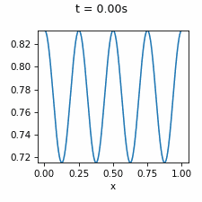 |
| Burgers              | [PDEBench](https://darus.uni-stuttgart.de/file.xhtml?fileId=268185&version=8.0)  | $u_t = -uu_x + \nu u_{xx}, \nu=0.1$| 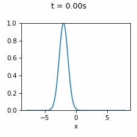 |
| Korteweg-de Vries (KdV)           | [PDE-Find](https://github.com/snagcliffs/PDE-FIND/tree/master/Datasets)  | $u_t = -6uu_x - u_{xxx}$ | 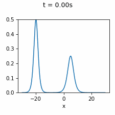 |
| Kuramoto-Sivashinsky (KS)         | [PDE-Find](https://github.com/snagcliffs/PDE-FIND/tree/master/Datasets)  | $u_t = -uu_x-u_{xx} - u_{xxxx}$ | 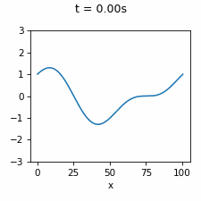 |
| Diffusion-Reaction (DR)        | [PDE-Find](https://github.com/snagcliffs/PDE-FIND/tree/master/Datasets) | $u_t = 0.1 \nabla^2 u + \lambda(A) u - \omega(A) v$ <br> $v_t = 0.1 \nabla^2 v + \omega(A) u - \lambda(A) v$ <br> $A^2 = u^2 + v^2, \omega(A) = -\beta A^2, \lambda(A) = 1 - A^2$ | 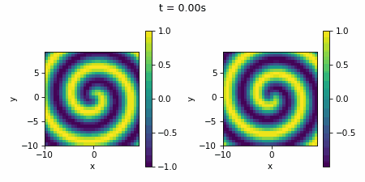 |
| Nonlinear Schrödinger (NLS)       | [PDE-Find](https://github.com/snagcliffs/PDE-FIND/tree/master/Datasets) | $u_t = 0.5 v_{xx} + u^2v + v^3$ <br> $v_t = -0.5 u_{xx} - u v^2 - u^3$ | 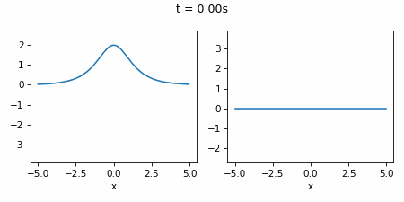 |
| Advection-Diffusion (AD)     | [DeepMod](https://github.com/PhIMaL/DeePyMoD/tree/master/examples/data)  | $u_t = 0.25 u_{x} + 0.5 u_y + 0.5 u_{yy} + 0.5 u_{xx}$ | 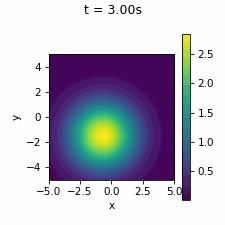 |
| Heat (Laser)             |Abali     | $\rho c u_t = \kappa\nabla^2u + \rho Laser(t)$ | 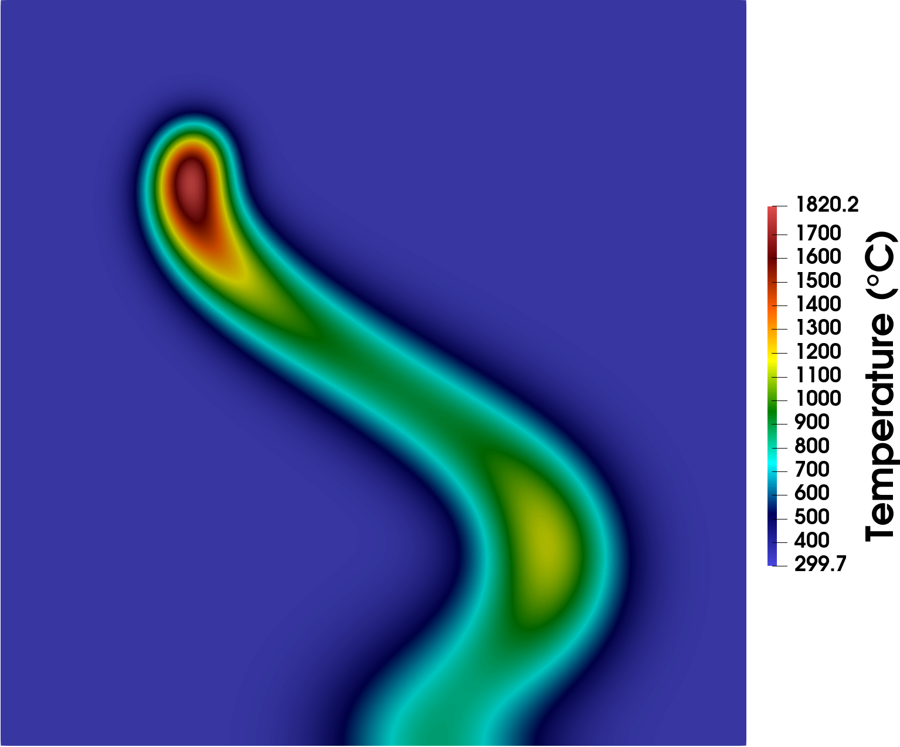 |
| Heat (Solar) 1D, 2D, 3D |FEniCS '12| $\rho c u_t = \kappa \nabla^2u + f$, uniform $\kappa$ | 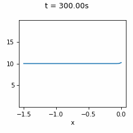 |
| | | | 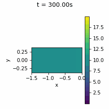 |
| Navier-Stokes Channel          |FEniCS '16| $\rho(u_t + u \cdot \nabla u) - \nabla\cdot \sigma(u, p) = f$ <br> $\nabla\cdot u = 0$| 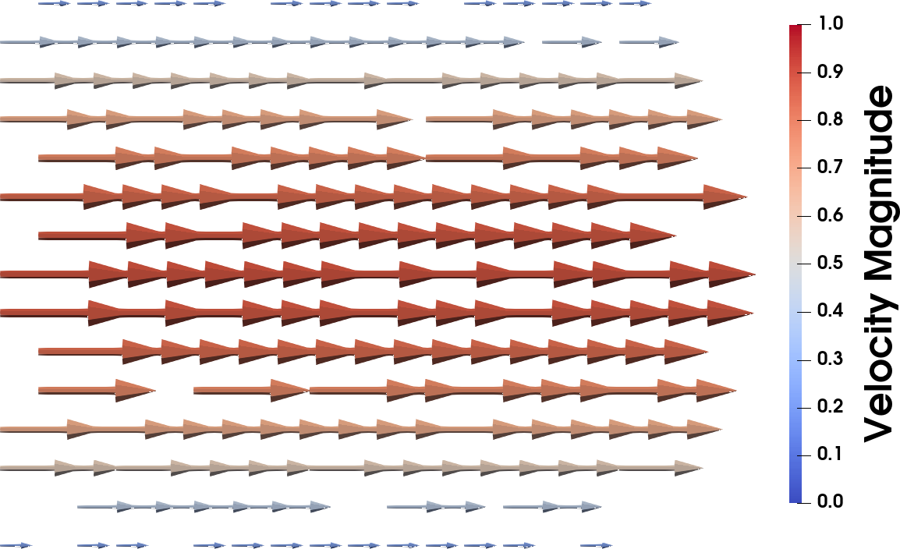 |
| Navier-Stokes Cylinder         |FEniCS '16| Same as above | 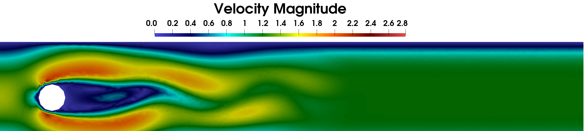 |
| Reaction-Diffusion Cylinder    |FEniCS '16| $\rho(w_t + w \cdot \nabla w) - \nabla\cdot \sigma(w, p) = f$ <br> $\nabla\cdot w = 0$ <br> ${u_1}_t + w \cdot \nabla u_1 - \nabla\cdot\epsilon\nabla u_1 = f_1 - K u_1 u_2$ <br> ${u_2}_t + w \cdot \nabla u_2 - \nabla\cdot\epsilon\nabla u_2 = f_2 - K u_1 u_2$ <br> ${u_3}_t + w \cdot \nabla u_3 - \nabla\cdot\epsilon\nabla u_3 = f_3 + K u_1 u_2 - K u_3$| 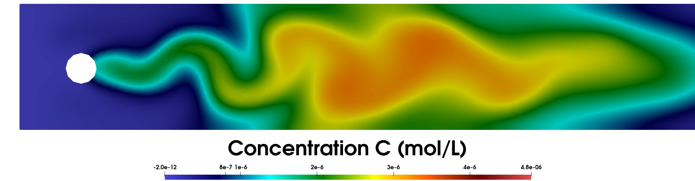 |

### Sources
- [Abali](https://doi.org/10.1007/978-981-10-2444-3) *Computational Reality* by Abali
- [ERL 2002](https://doi.org/10.1007/s00466-001-0273-z) *The analysis of the generalized-alpha method for non-linear dynamic problems* by Erlicher et al. [Code](https://comet-fenics.readthedocs.io/en/latest/demo/elastodynamics/demo_elastodynamics.py.html)
- [FEniCS '12](https://doi.org/10.1007/978-3-642-23099-8) *Automated Solution of Differential Equations by the Finite Element Method: The FEniCS Book* by Logg et al.
- [FEniCS '16](https://doi.org/10.1007/978-3-319-52462-7) *Solving PDEs in Python: The FEniCS Tutorial I* by Langtangen and Logg


## Methods

Here is a summary of the algorithms and their descriptions. The algorithms are implemented in the `mdbench/algorithms` directory.

| Method Name   | System Type | Source
|-|-|-|
| PDE-FIND      | PDE     | [Paper](https://www.science.org/doi/10.1126/sciadv.1602614) [Github 1](https://github.com/snagcliffs/PDE-FIND) [Github 2](https://github.com/dynamicslab/pysindy) |
| SINDy         | ODE     | [Paper](https://arxiv.org/abs/1509.03580) [Github](https://github.com/dynamicslab/pysindy) |
| WSINDy        | PDE     | [Paper](https://arxiv.org/abs/2007.02848) [Github 1](https://github.com/MathBioCU/WSINDy_PDE) [Github 2](https://github.com/dynamicslab/pysindy) |
| EWSINDy      | ODE/PDE | [Paper](https://arxiv.org/abs/2111.10992) [Github](https://github.com/dynamicslab/pysindy) |
| Bayesian      | PDE     | [Paper](https://arxiv.org/abs/2306.04894) [Github](https://github.com/TapasTripura/Bayesian-Discovery-of-PDEs/blob/main/utils_0.py) |
| DeepMoD       | PDE     | [Paper](https://arxiv.org/abs/1904.09406) [Github](https://github.com/PhIMaL/DeePyMoD/) |
| EQL           | ODE/PDE | [Paper](https://proceedings.mlr.press/v80/sahoo18a.html) [Github](https://github.com/martius-lab/EQL?tab=readme-ov-file) |
| uDSR          | ODE/PDE | [Paper](https://openreview.net/forum?id=2FNnBhwJsHK) [Github](https://github.com/dso-org/deep-symbolic-optimization) |
| PySR          | ODE/PDE | [Paper](https://arxiv.org/abs/2305.01582) [Github](https://github.com/MilesCranmer/PySR) |
| Operon        | ODE/PDE | [Paper](https://dl.acm.org/doi/10.1145/3377929.3398099) [Github](https://github.com/heal-research/operon) |
| ODEformer     | ODE     | [Paper](https://arxiv.org/pdf/2310.05573.pdf) [Github](https://github.com/sdascoli/odeformer) |
| End2End       | ODE/PDE | [Paper](https://arxiv.org/abs/2204.10532) [Github](https://github.com/facebookresearch/symbolicregression?tab=readme-ov-file) |

## Adding a New Method
In order to add a new algorithm to the pipeline, create a new directory under `mdbench/algorithms/ode/` or `mdbench/algorithms/pde/` or `mdbench/algorithms/sr/` depending on the type of systems the method solves. In the newly created directory, two files are necessary:
1. `environment.yml`: Conda environment containing dependencies which are not part of the base packages (`requirements.txt` in the repo's root directory).
2. `regressor.py`: Contains a class named `Regressor`. Its constructor takes the hyperparameters and the number of parallel jobs (`n_jobs`) as keyword arguments.

    - The space of hyperparameters are defined in a dictionary named `hyper_params` located outside of the class. The pipeline trains separate models with all the possible hyperparameter combinations and picks the best hyperparameter setting based on the performance on the validation data. The final model is trained on the training and validation data with the chosen hyperparameter setting.

    - The parallel execution mechanism acts in two ways: 1) for GP-based methods and the methods that MDBench does not perform hyperparameter optimization, the `n_jobs` keyword argument is passed to the algorithms' constructor; 2) for other methods, the parallel execution occurs only in hyperparameter tuning phase and not in the training phase.

    - The method for discovering PDEs should implement `set_spatial_grid(self, s)`, which fixes the spatial grid over which the functions are evaluated.

The `Regressor` class should implement the following methods:
- `fit(t_train, u_train, u_dot_train)`:
trains the model given the observed trajectory and approximated derivatives.

- `predict(t_test, u_test)`: predicts the time derivatives given the observed trajectory.
- `complexity()`: complexity of the learned equation which is defined as the total number of variables, operations, and constants in the equation.
- `to_str()`: returns the discovered equations in string and human-readable format.

## Citation

If you find our benchmark or dataset useful for your work, consider a ⭐️ and citing us with

```bibtex
@article{bideh2025mdbench,
  title={MDBench: Benchmarking Data-Driven Methods for Model Discovery},
  author={Bideh, Amirmohammad Ziaei and Georgievska, Aleksandra and Gryak, Jonathan},
  journal={arXiv preprint arXiv:2509.20529},
  year={2025}
}
```

## License

This project is licensed under the MIT License - see the [LICENSE](LICENSE) file for details.
